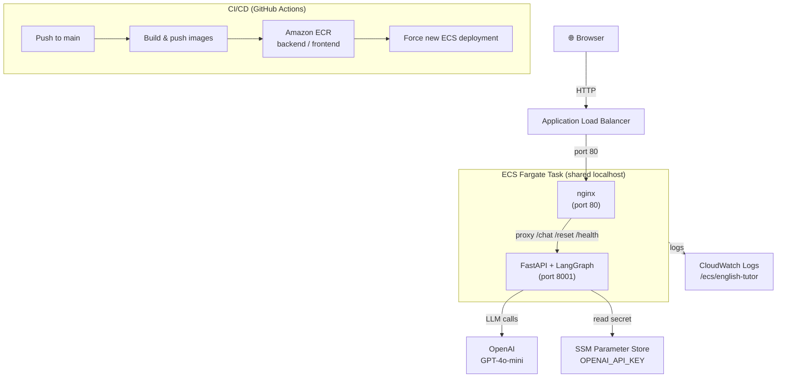

# English Tutor Agent

An AI-powered English tutor that detects grammar, spelling, and syntax errors in real time. Chat naturally, receive instant corrections highlighted inline, and review all your mistakes in a dedicated **Errors** tab.

**Stack:** FastAPI · LangGraph · OpenAI GPT-4o-mini · React · Vite · nginx · Docker

---

## Quick start (Docker)

The easiest way to run the app — no Python or Node setup required.

```bash
cp .env.example .env
# Open .env and set your OPENAI_API_KEY
docker compose up --build
```

App is available at `http://localhost`.

---

## Project layout

```
backend/
  api.py            FastAPI service (/chat, /reset, /health)
  graph.py          LangGraph agent graph
  nodes.py          Analyze + respond nodes (OpenAI calls)
  state.py          AgentState TypedDict
  memory.py         In-memory session store
  requirements.txt  Python dependencies
  example.ipynb     Exploration notebook

frontend/
  src/
    App.jsx         Chat UI with inline error highlighting and Errors tab
    styles.css

Dockerfile.backend   Python 3.12-slim image
Dockerfile.frontend  Multi-stage: Node build → nginx serve
nginx.conf           Proxies /chat /reset /health to backend
docker-compose.yml   Wires backend + frontend containers
.env.example         Required environment variables
```

---

## Features

- **Inline highlights** — error fragments are highlighted in orange in your message
- **Error table** — per-message 3-column table: Error · Correction · Why
- **Errors tab** — flat view of every error from the session with unread badge
- **Session memory** — conversation history is kept per session ID (stored in `localStorage`)

---

## Local development (without Docker)

### Backend

```bash
python -m venv tutor_agent_venv
source tutor_agent_venv/bin/activate
pip install -r backend/requirements.txt
cp .env.example .env   # add your OPENAI_API_KEY
cd backend
uvicorn api:app --reload --port 8001
```

### Frontend

```bash
cd frontend
npm install
npm run dev
```

Frontend runs at `http://localhost:5173` and proxies API calls to `http://localhost:8001`.

---

## Deployment (AWS ECS Fargate)

The app is deployed on AWS ECS Fargate behind an Application Load Balancer.

**Live URL:** `http://english-tutor-alb-445723719.eu-west-1.elb.amazonaws.com`

### Architecture



### Infrastructure

| Component | Details |
|-----------|---------|
| ECS Cluster | `english-tutor` (Fargate, `eu-west-1`) |
| Task | 2 containers per task (backend + frontend) sharing `localhost` networking |
| Load Balancer | ALB → Target Group → ECS task on port 80 |
| Secrets | `OPENAI_API_KEY` injected from AWS SSM Parameter Store |
| Logs | CloudWatch Logs — `/ecs/english-tutor` |
| Container Registry | Amazon ECR — `english-tutor-backend` / `english-tutor-frontend` |

### CI/CD (GitHub Actions)

Every push to `main` automatically:

1. Builds and pushes both Docker images to ECR
2. Forces a new ECS deployment (`update-service --force-new-deployment`)
3. Waits for the service to stabilise (`ecs wait services-stable`)

**Required GitHub secrets:**

| Secret | Description |
|--------|-------------|
| `AWS_ACCESS_KEY_ID` | IAM user access key |
| `AWS_SECRET_ACCESS_KEY` | IAM user secret key |
| `AWS_REGION` | `eu-west-1` |

---

## API reference

| Method | Path | Description |
|--------|------|-------------|
| `GET` | `/health` | Health check |
| `POST` | `/chat` | Send a message; returns `session_id`, `response`, `corrected`, `errors` |
| `POST` | `/reset` | Clear session state |

`POST /chat` request body:
```json
{ "message": "Yesterday I goed to market", "session_id": null }
```

`errors` in the response is a list of objects:
```json
[{ "fragment": "goed", "correction": "went", "description": "..." }]
```
